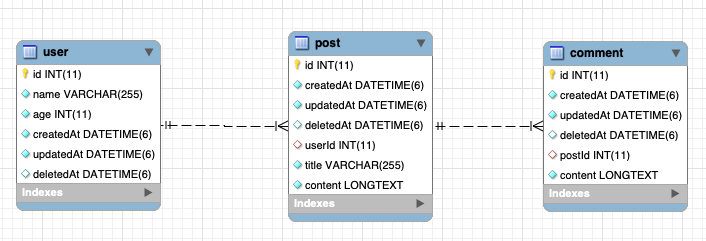

# softDelete와 withDeleted

withDeleted() 호출 위치에 따라 IS NULL이 어떻게 조건절에 추가되는지 알아보자.

* 모델

Steps to run this project:

1. Run `npm i` command
2. Setup database settings inside `data-source.ts` file
3. Run `npm start` command
